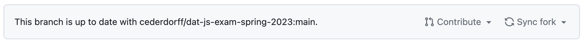
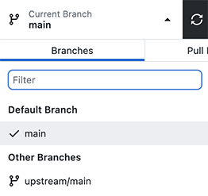

# dat-js-exam-spring-2023
> Main GitHub Repository for 1st semester Exam, 2023 - DAT23V1 and DAT23V2

## Kort beskrivelse

Dette repository indeholder de environments der skal bruges til **eksamen**. Når du til selve eksamen trækker en opgave, får du at vide hvilket environment der hører til - åbn den pågældende mappe, og åbn `index.html` med Live Server. Gå derefter i gang med at løse opgaven og skriv din JavaScript kode i `script.js`.

## Fork
Før eksamen skal du have forket dette repository, så du har en udgave på din egen GitHub konto. Clone din egen udgave så du har den liggende lokalt på din computer, klar til brug til eksamen.

## Opdatér
Der kan ske ændringer i dette repository, så sørg for at opdatere din fork. Det kan du enten gøre direkte på GitHub.com eller via GitHub Desktop. Sørg for at gøre det igen kort før du skal op til eksamen!

### Github.com
Gå ind på dit eget repository på github.com, og find knappen "Sync fork" lige under den grønne "Code" knap:

Hvis der ikke står "This branch is up to date ..." skal du helt sikkert trykke Sync fork!

Så får du den nyeste udgave.

### Github Desktop
Gå ind på dit repository i GitHub Desktop, og vælg Branch-menuen (den i midten). Tryk på "upstream/main" og du vil merge ændringer fra den seneste opdatering ind i dit eget repository.

Så har du også den seneste udgave.